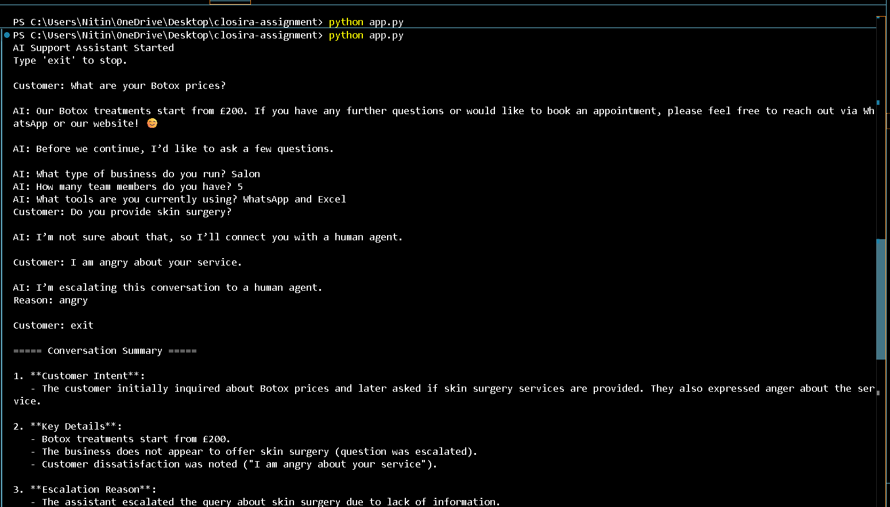

# Closira AI Assignment

AI-powered customer support workflow built for the Closira AI Engineering Internship Assignment.

---

# Features

- SOP-based FAQ answering
- Hallucination prevention
- Lead qualification workflow
- Escalation detection
- Structured conversation summaries
- CLI-based customer interaction

---

# Project Structure

closira-assignment/
│
├── app.py
├── sop_data.json
├── requirements.txt
├── README.md
├── prompt_design.md
├── .env
│
├── test_transcripts/
│   ├── escalation.md
│   ├── faq_test.md
│   ├── lead_qualification.md
│   ├── out_of_scope.md
│   └── summary.md

---

# Features
- SOP-based FAQ answering
- Lead qualification workflow
- Escalation detection
- Conversation summary generation
- Hallucination prevention

# Tech Stack
- Python
- OpenAI/Groq API
- JSON

# How to Run
pip install -r requirements.txt
python app.py

# Model Used

This project uses DeepSeek Chat via OpenRouter API for cost-efficient inference.

# Safety Features

- SOP-grounded responses
- Escalation for unknown queries
- Sentiment-based escalation detection
- No hallucinated responses

# Setup Instructions:


#1. Clone Repository

```bash
git clone <your-github-repo-link>
cd closira-assignment

#2. Install Dependencies
pip install -r requirements.txt

#3. Add Environment Variables

Create .env

OPENROUTER_API_KEY=your_api_key_here

#4 Run The Project
python app.py

Example Workflow

Customer asks a question →

AI checks SOP →

AI answers safely →

AI qualifies lead →

AI detects escalation if needed →

AI generates structured summary

Technologies Used
Python
OpenRouter API
DeepSeek Chat Model
python-dotenv
OpenAI SDK
Hallucination Prevention

The assistant is instructed to answer only using provided SOP data.
If information is unavailable, the AI escalates instead of generating false information.

Escalation Logic

Escalation occurs for:

angry customers
complaints
medical questions
pricing negotiation
unknown/out-of-scope questions
Limitations
CLI only (no frontend UI)
Uses keyword-based escalation detection
Limited to provided SOP data


# Demo Screenshot



# closira-assignment
>>>>>>> 19b69779821c44ddb8bc41e9c178028555a0d8cd
